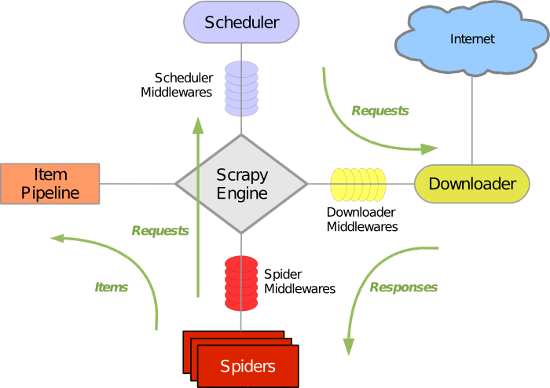

# Scrapy
- pyspider : 可以快速编写爬虫，但可配置化程度不高，异常处理能力有限
- scrapy : 基于Twisted的异步处理框架，功能强大，爬取效率高，相关扩展件多，可配置和可扩展程度非常高，几乎可以应对所有的反爬虫网站
- 参考教程
    - [scrapy中文版](https://scrapy-chs.readthedocs.io/zh_CN/0.24/intro/tutorial.html)
    - [scrapy官方文档](https://docs.scrapy.org/en/latest/)
## 1. scrapy框架介绍
- 
- ScrapyEngine :　引擎，处理整个系统的数据流处理、触发事件，是整个框架的核心、大脑
- Item : 项目，定义爬取结果的数据结构，爬取的数据会被赋值成该Item对象
- Scheduler : 调度器，接受引擎发过来的请求(Request)并将其加入队列中，在引擎再次请求时将请求(Request)提供给引擎
- Downloader : 下载器，下载网页内容，并将网页内容返回给蜘蛛
- Spider :　蜘蛛，定义爬取的逻辑和网页的解析规则，负责解析响应，提取结果(item)和生成新的请求(Request)
- Item Pipeline :　项目管道，负责处理由蜘蛛从网页中抽取的项目，清洗、验证和存储结果
- Middleware
    - Downloader Middlewares : 下载中间件，位于引擎与下载器之间的钩子框架，处理引擎和下载器之间的请求及响应（设置User-Agent、Cookies、代理。。。）
    - Spider Middlewares : 蜘蛛中间件，位于引擎和蜘蛛之间的钩子框架，处理蜘蛛输入的响应和输出的结果及新的请求

## 2. scrapy入门
- 安装
    - `pip install scrapy`
- **创建项目**
    - `scrapy startproject <project name>`
    - 项目结构
        ```
            - scrapy_test/      项目
                - spiders/      包含一个个spider的实现，每个spider都是一个文件
                    - __init__.py 
                    - spider1.py
                    - spider2.py
                - items.py        Item的定义、定义爬取的数据结构
                - middlewares.py  Middlewares的定义，定义爬取的中间件
                - pipelines.py    Pipelines的定义，定义数据管道
                - settings.py     配置文件
            - scrapy.cfg       scrapy项目部署时的配置文件
        
        ```
- **创建Spider**
    - `cd <project name>`  ---> `scrapy genspider <spider name> <domian name>`
    - 如：`cd scrapy_test` ---> `scrapy genspider hittbin httpbin.org`
    - 进入创建的项目(scrapy_test)文件夹，执行scrapy genspider 命令，第一个参数是spider名称，第二个参数是网站域名
    - spiders/httpbin.py
        - 三个属性
            - name : 蜘蛛唯一的名字，用于区分不同的spider
            - allowed_domains : 允许爬取的域名
            - start_urls : 包含spider在启动时爬取的url列表，初始请求由它定义
        - 一个方法
            parse : 负责解析返回的响应、提取数据或进一步生成要处理的请求
- **创建Item**
    - Item是保存数据的容器，使用方法与字典类似
    - 定义要爬取的数据字段
- **启动爬虫**
    - `scrapy crawl <spider name>`
    - 如：`scrapy crawl httpbin`
    - 运行结果说明
        - 输出当前的版本号及正在启动的项目名称
        - 输出settings.py中一些重写后的配置
        - 输出当前的Middlewares(默认启用的)，可在settings.py中修改
        - 输出当前的Pipeline(默认为空)，可在settings.py中配置
        - 输出页面的抓取结果，边解析边翻页，直至抓取完毕
        - 输出整个爬取过程的统计信息（请求的字节数、请求次数、响应次数、完成原因、时间。。。）
- **保存到文件**
    - scrapy提供的Feed Exports可以轻松将抓取结果输出
    - `scrapy crawl <spider name> -o <filename>`
    - 如：`scrapy crawl quotes -o quotes.json`
        - 也可以为每一个Item输出一行json，输出后缀为jl(jsonline)
        - `scrapy crawl quotes -o quotes.jl` or `scrapy crawl quotes -o quotes.jsonlines`
    - 输出格式多种，如json、csv、xml、pickle、marshal。。。
        - `scrapy crawl quotes -o quotes.csv`
        - `scrapy crawl quotes -o quotes.xml`
        - `scrapy crawl quotes -o quotes.pickle`
        - `scrapy crawl quotes -o quotes.marshal`

- **使用Item Pipeline**
    - 作为项目管道，当Item生成后，自动被送到Item Pipeline进行处理
        - 清洗HTML数据
        - 验证爬取数据，检查爬取字段
        - 查重并丢弃重复内容
        - 将结果保存到MongoDB数据库
    - 定义类，并实现process_item(self,item,spider)方法，启用Item Pipeline会自动调用这个方法
    - process_item()方法必须返回包含数据的字典或Item对象或抛出DropItem异常
    - process_item:
        - spider提取出来的item作为参数传入，同时传入的还有spider
        - 此方法必须实现
        - 必须返回一个Item对象，被丢弃的item不会被之后的pipeline处理
    - __init__:构造函数
        - 进行一些必要的参数初始化     
    - open_spider(spider):
        - spider对象被开启的时候调用
    - close_spider(spider):
        - 当spider对象被关闭的时候调用 
    - 在settings.py中加入ITEM_PIPELINES={k1:v1,k2:v2}的配置信息，键名为Pipeline的类名称，键值为数字，表示调用的优先级，数字越小优先级越高
        
- 爬虫项目大概流程
    - 新建项目：scrapy startproject xxx
    - 明确需要目标/产出:  编写item.py
    - 制作爬虫 ： 地址 spider/xxspider.py
    -  存储内容： pipelines.py
    - 案例scrapy_quotes

## 3. Selector的用法
- 直接使用
    - Selector可以是一个独立的模块，直接利用Selector这个类来构建一个选择器对象，调用xpath()、css()方法提取信息
    ```cython
    from scrapy import Selector 
  
    body = "<html><body><head><title>Hello world</title></head></body><html>"
    selector = Selector (text= body )#传入参数text
    #extract: 返回提取结果列表，extract_first(): 返回列表第一个元素
    title = selector .xpath('//title/text()').extract_first () 
    print(title) 
    ```
- scrapy shell启动终端
    - `scrapy shell <url> (--nolog)`
    - `scrapy shell https://doc.scrapy.org/en/latest/_static/selectors-sample1.html`
    - 进入命令行调试
- XPath选择器
    - response.selector.xpath() == response.xpath()
    - 用法与Xpath基本一样（嵌套查询、提取内容、提取单个内容、获取文本和属性）
    - 使用extract()获取需要的内容，返回为列表类型，extract_first('default')返回列表第一个元素，匹配不到返回空，或为定义的默认值
        - 如：`response.xpath('//a/text()).extract()`
        - 如：`response.xpath('//a[@href="image.html"]/img/@src).extract_first()`
    - 注：选择器前加 . 代表提取元素内部数据，没有点. 代表从根节点开始提取
- CSS选择器
    - response.selector.css() == response.css()
    - 用法与CSS选择器的用法基本一样
    - 获取文本和属性的用法与xpath有点不一样
    - 获取文本::text, 获取属性::attr(attr_name)
        - 如：`response.css('a[href="image.html"]::text').extract()`
        - 如：`response.css('a[href="image.html"] img::attr(src)).extract_first()`
    - 注：css和xpath可以混合嵌套使用
        - 如：`response('//a').css('img').xpath('@src').extract()`
        
- 正则表达式
    - scrapy选择器支持正则匹配
        - 类似extract_first()，存在re_first()方法可以选取列表的第一个元素
        - 如：`response.xpath('//a/text()).re('Name:\s(.*)')`
        - 如：`response.xpath('//a/text()).re_first('Name:\s(.*)')`
    - 注：response对象不能直接调用re()，可以先调用xpath()再正则匹配
        - 如：`response.xpath('.').re_first('Name:\s(.*)')`

## 4. Spider的用法
- 对应的是文件夹spiders下的文件
- spider要做的两件事
    - 定义爬取网站的动作
    - 分析爬取下来的网页
- __init__: 初始化爬虫名称，start_urls列表
- 属性
    - name : 设置爬虫名称，唯一的
    - allow_domains : spider允许爬去的域名列表
    - start_urls : 设置开始第一批爬取的url，没有实现start_requests()方法时，默认从这个列表开始抓取
    - custom_settings : 字典，专属于本spider的配置，覆盖全局设置，必须在初始化前被更新，定义为类变量
    - crawler : 由from_crawler()方法设置，代表的是本spider类对应的crawler对象，crawler包含很多项目组件，利用它可以获取项目的一些配置信息
- 常用方法
    - start_requests() : 默认使用start_urls里面的url生成Requests对象交给Scrapy下载并返回response
    - parse() : 根据返回的response解析出相应的item，item自动进入pipeline； 如果需要，解析出url，url自动交给requests模块，一直循环下去
    - start_request() : 此方法仅能被调用一次，读取start_urls内容并启动循环过程，默认是GET请求方式
        - 启动时以POST访问某个站点，重写这个方法，发送POST时使用FormRequest
        ```
        def start_requests(self):
        return [scrapy.FormRequest("http://www.example.com/login",
                               formdata={'user': 'john', 'pass': 'secret'},
                               callback=self.logged_in)]

        def logged_in(self, response):
            # here you would extract links to follow and return Requests for
            # each of them, with another callback
            pass
        ```
    - closed() : 当spider关闭时，该方法被调用，一般会定义释放资源的一些操作或其他收尾工作 
    - log(message,level=log.WARNING) : 日志记录
    
## 5. Downloader Middleware的用法